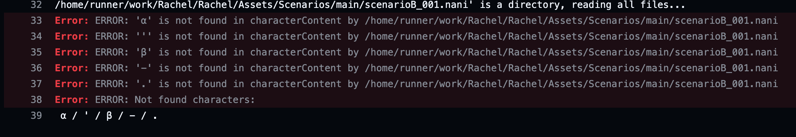

# naninovel-atlas-tofu-check

In [Naninovel](https://naninovel.com/) scenario files, check if there are any items that are not in Textmeshpro's font atlas.

## usage

Call it from GithubActions and use it.

```yaml
- name: Scenario Tofu check
  uses: tunacook/naninovel-scenario-tofu-check@v0.0.0
  with:
    charactersFilePath: "Assets/Resources/Fonts/characters.txt"
    scenarioFileDirectoryPath: "Assets/Scenarios"
```

If there is a character in the directory specified in `scenarioFileDirectoryPath` that is not in the file in `charactersFilePath`, it will give us an error like this.


